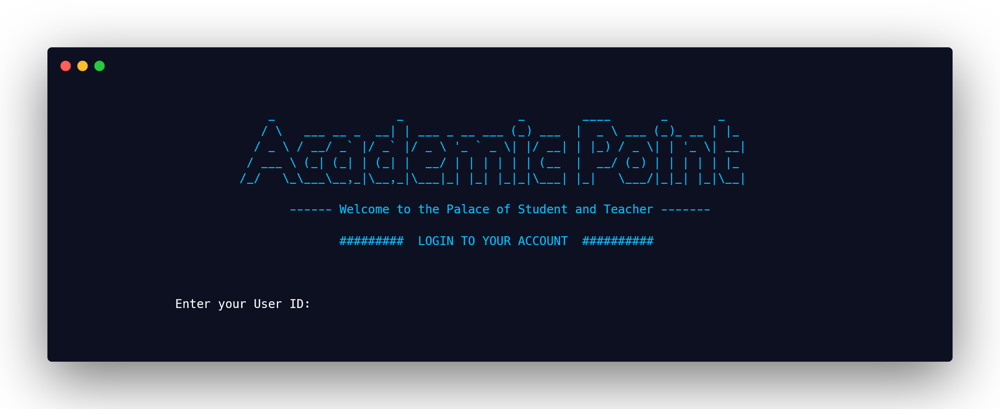
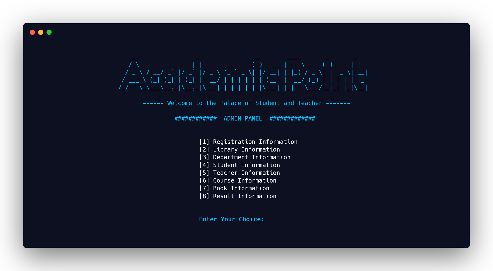
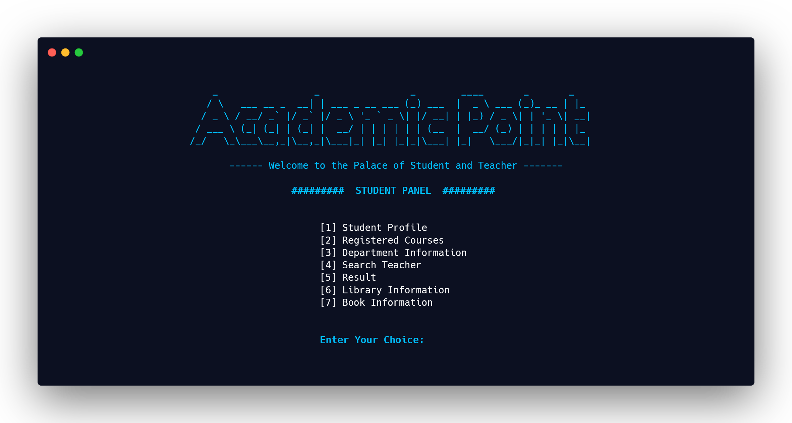
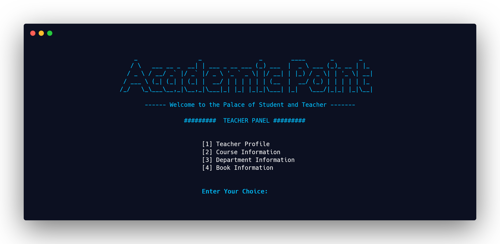
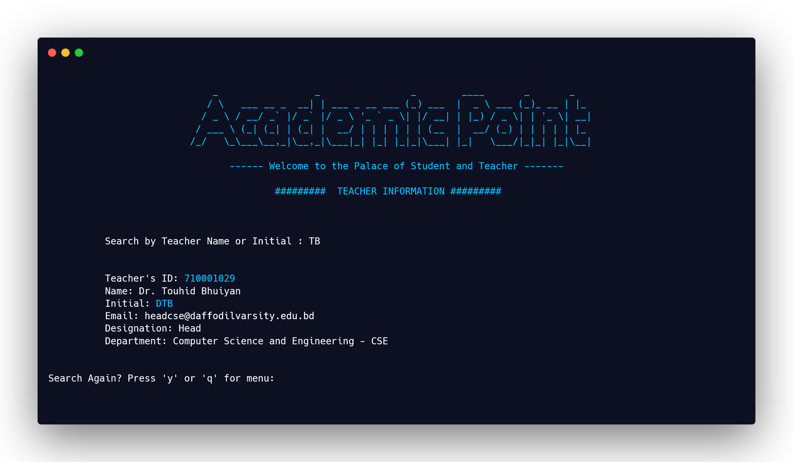
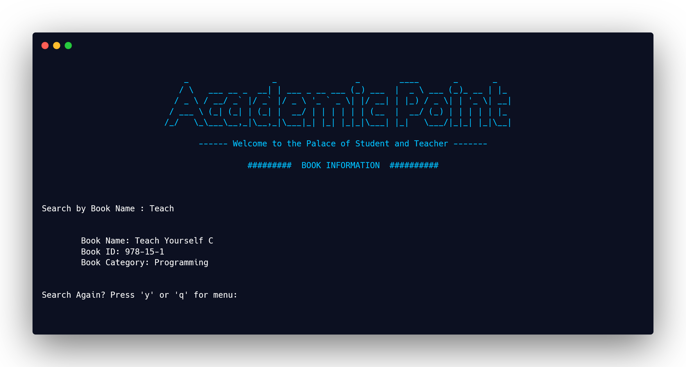
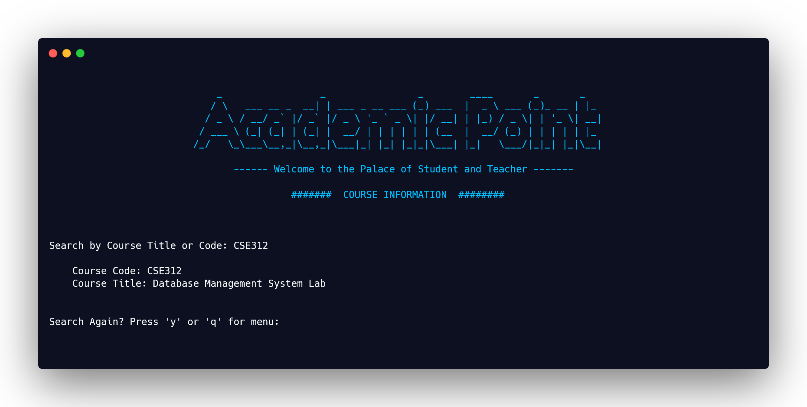

<h1 align="center"><b>Student Information System
</b> </h1>
<h3 align="center"><b>By Dynamic Duo
</b> </h3>

Login

## About Project

This project is about Student Information System using Python and here we have chosen SQLite for storing information in a SQL database. In this console application, there are three section which is Student Panel, Teacher Panel and Admin Panel. Here we focused on our SQL database. 

Admin Panel

* In the **Admin Panel**, there are 8 options and an Admin has access to all sections that means an Admin can change anything of Teacher Panel and Student Panel. But students and teachers do not have these access. 

Student Panel

* A **Student** can view his/her result, courses, teachers, library information etc. 
And a student can change his/her personal information such as phone number address etc. 

Teacher Panel

* A **Teacher** can view the department information, course information etc and can change his/her phone number, email etc. 

So, this project is a python console application where we have implemented a platform where student, teacher can view their important information and change some particular information. **This platform is for Student and Teacher mainly so that it will be easy for them to be connected where they can know every information in a single place.**
 

#### This Project is made using Python and SQL Database (SQLite).

Teacher Search

Book Information

Course Information

### Team - Dynamic Duo
  [Shumaiya Akter Shammi](https://github.com/Shammi179) 
  [Sajal Das](https://github.com/sajaldas19)  
 
